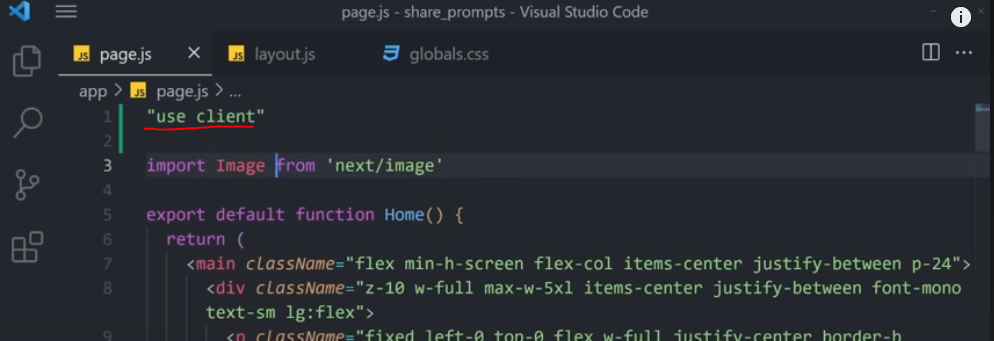
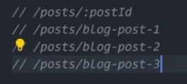

# Introduction
- A.i or web Development me time to time advancement k hisab se aap ko iss k sath up to dated rehna bohat hi zaroori hota hy tha k aap industry k sath relevant rahy etc.

- Facebook ne 2013 ko React framework ko launch kiya jiss ne web development me revlution barpa krdiya.
- magr 2023 k react ne apne official documentations me khud kaha k bhai aap plain react ko use na kare bal k iss k upar jo or technologies banni hy oss ko use kare jiss me onhone apne documentations me next.js ko top pr rakha etc.
- matlab iss ne apne documentations me ye kaha k bhai aap onn framework ko use karo jo k react k upar base hy jo k communities me popular hy etc. jiss me first number pr Next.js ata hy.
- Pro Tip: Project banana or phir oss ko apne portfolio me add krna apne resume me add krna zaroori hota hy etc.

- Node.js ne b khud kaha hy k bhai hum logo ne apne website ko Next.js me convert krdiya hy etc.
- iss k ilawa b bohat barhi barhi companies Next.js ko use krthi hy jaise Netflix,Tiktok,Twitch,hoolu,Notion,Nike and Many More.....
- upcoming months ya phir time me aap ko Next.js k bohat sari jobs dekhne ko milega.
- So this is the ideal moment for you to acquire your Next.js skills Show the potential employers that your're prepared.
- the best way to do that is to build you own modern Next.js ful stack app
- bhai dekho aap jub b kisi skills ko sikh rhy ho tho oss k upar kuch na kuch build krna zaroori hota hy for confidence and many more matlab project bnanana or ye project kuch b ho sakta hy etc.

- Tho hum pehly aik Crash course karenge or phir apne oss sare knowledge ko aik application ko build krne k liye use karnege jiss application ka naam hy promptopia jo k gpt k prompt k related hy.

some thing like this.
- tho iss project me aap prompt ko search kr sakty hy or apne prompt ko create kr sakty hy. Delete kr sakty hy. Or aap dosre logo k profile b dekh sakty hy. matlab ye aik full stack Next.js application hy. or iss ko apne resume me add krna b hy don't overthinking.
- matlab hum log full stack next.js crud application ko banayenge.

- magr start krne se pehly aik sawal hy k aisa kiya hy jo k next.js me hy magr react me nhi?

###  Question: What does Next.js have that React doesn't? The Benefits of Nex.js

#### Next.js
- Next.js simpliefies the development process.
- matlab next.js aap ko bohat sari cheeze buil-in provide krdeti hy jiss ko aap ko sirf bs use krna hy jaise react me routing k liye aap ko react-router-dom k package ko install kr k use krna hota hy magr react me aisa nhi hy etc simple aik main difference inn dono k bech me yehi hy.
- Next.js: On top of that it optimizes your web apps.
- Next.js aap k application ko optimize krtha hy through its primary features tho chalaye iss features ko step by step discuss krthy hy.
##### Rendering
- Main jo difference hy react or next.js k bech me wo hy rendering aap k pass react jo hy wo client side pr rendering krtha hy magr Next.js jo hy wo aap k pass server-side rendering krtha hy jiss se SEO improve hoti hy. 

- Tho aap k pass Next.js server-side rendering krtha hy.
- Note: but the Next.js are provide the both functionality of the server-side or client side rendering according to your need.
- next.js aap ko dono cheeze provide krtha hy bs jiss component ko aap ko client side pr render krna hota hy oss k upar use- client etc hota hy jiss ko hum agy ja kr explore karenge use hota hy etc. simple.

- Or React jo hy aap k pass client side rendering krtha hy.

### The Main Question What is Client-side and Server-Side Rendering? & which one is better?
#### Client-Side Rendering
-  clinet-side rendering and browser rendering happen to the client side
- client-side or browser side rendering aap k pass broswer pr hota hy matlab ye server pr nhi hota hy bal k client side pr hota hy simple.

- Client-Side Rendering me ye hota hy k jub aap kisi b cheez ko search krthy ho tho server jo hy basic html,css,js jo hy borowser ko de deta hy or phir browser oss ko download krdeta hy or phir aap k pass website jo hy display hojati hy simply yehi hota hy client-side rendering etc.

#### Server-Side Rendering
-  Server-side rendering:  Rendering the web page on the server But  Before trasmitting it to the client's device/
- jub b client jo hy request krtha hy tho server-side rendering me ye hota hy k aap k pass sari ki sari cheeze direct client side pr nhi ati hy bal k wo pehly jo server-side pr components jo hy download hojatay hy or phir server-side pr processing hone k baad phir browser ko de deta hy or phir browser oss ko download kr k aap k samne web pages ko show krdeta hy.

- Tho server-side ne jo cheeze download ki hoti hy oss ko as it as jo hy client ko phir de deta hy magr pehly server-side pr render hota hy etc simple.

- or iss server-side rendering se hamare pass web development ka aik main aspect jo hy cover hojata hy jo k hy SEO ka iss se aap ki SEO easy hojati hy jo k React js me mushkil hy etc. q k React Client-Side Rendering krtha hy etc.

#### SEO
- q k SEO me browser ko mushkil hoti hy k wo client side pr hone wale cheezo ko crawl kr saky jiss se aap k pass SEO improve hota hy magr Next.js tho server-side pr rendering krtha hy jo k iss problem ko solve krdeta hy or SEO ki crawling easily hojati hy etc.
-  by the utiliziation the Next.js This issue is resolved by sending pre-rendered code directly to the client.
- tho iss server-side rendering se hamare pass enables hojati hy.
1. Easy Crawling
2. Indexing
- Leading to improve SEO

- Magr SEO q zaroori hy oss k liye niche dekhe
- SEO: --> SEO is crucial for optimizing a website's visibility and ranking n search engine results.
- Q k SEO se aap increase kr sakty hy 
1. SEO: Increase organic Traffic
2. SEO: Enhanced User Experience
3. Credibility and trusworthness
- prioritizing the SEO can greatly impact the Success of your website and its online presence.

- The Second Next.js Great Feature is Routing

#### Routing
- React me routing krne k liye hum logo ko additional package jo react-router-dom hota hy install krna parhta hy magr Next.js me aisa kuch nhi hota hy aap ko kuch b additional install krne ki zaroorat nhi hoti hy etc.
- Next.js: Next.js uses the file-based routing system. which means the routing is handle by the file system.
- Matlab Next.js me aap ko routing k liye koi additional package jo hy install krne ki zaroorat nhi hy bs aap file based system ka use kr k routing kr sakty hy etc. simple.


- Each folder in the app directory is becomes the route.
- app directory k andar aap jo b folder banatay hy tho wo aap k pass route hojata hy. 
- magr react me aap ko functoin banana hota hy or phir export or import krna hota hy or phir oss koi use krna hota hy matlab call krna hota hy magr Next.js me aisa nhi hy.
- Next.js me aap file-based system ko use kr k easily routing kr sakty hy etc. 

- Or phir oss folder ko aap kuch iss trha se routing me call kr sakty ho ya phir Link kr k jo k aik popular way hy.
- iss se aap k pass file folder etc organize b hojati hy jo k bohat hi important hota hy.

- No need for external packages or complex configurations.  You can create files for the routes you want.

- Another huge Next.js feature is it's flexibility to create full stack application

#### Full Stack
- Next.js version 9 k baad Next.js k banane walo ne iss k andar aik or feature ko add kiya jo k aap k pass ye hy k aap iss se fullstack applications thak ko bana sakty hy etc.
- jo  k Api Routes hy.
- From Next.js V9 Developers behind Next.js introduced a new feature Called API Routes.
#### API Routes
- Enabling the creation of serverless functions to handle API requests. 
- Serverless APIs in Next.js are a way of creating API endpoints withou to need for a traditional server
- Matlab aap Api Routes ki madad se serverless functions ko bana sakty hy for to handle the api requests. Matlab api k requests ko handle krne k liye aap log Api Routes ka use krthy hy.

- tho api routes ko use krne k liye aap ko simple apne folder k anar routes.js k naam se file ko banan hota hy. aap jiss b folder me api routes ko use krna chahtay hy bs waha pr iss naam se file banaye etc.
- iss api routes ko hum log aghy ja kr explore karenge jub hum log jo hy project ko banayenge etc.

### Lee Robinson VP of Developer Experinece at vercel
- Lee Robinson jo vice president hy at vercel me jiss ne Next.js ko b banaya hy wo vecel aik company hy. tho iss ne apne aik post article me kaha hy k bhai agr aap React,express,webpack ki jagah agr aap Next.js se apni application ko banatay ho tho iss se aap k taqreeban 20,000 thousands line of code jo hy reduce hojata hy jo k aap k application improve krtha hy etc.
- jo k aap k application k speed ko improve krtha hy iss ne kaha hy k Next.js aap k application ko 1.3s se 131ms mili-second thak aap k application ko fast krdeta hy jo k 10x gunna kam hy etc. 
- tho simple c baat hy k ye aap k application k speed ko b improve krtha hy etc.

- Agla Feature jo Next.js ka hy wo hy Automatic Code Splitting

#### Automatic Code Splitting

- code splitting aik technique hy jiss me larege codeo of javaScript ko small and manageable chunks me devide kiya jata hy.
- or ye code plitting code tub load hota hy jub iss ki need hoti hy.
- React me aap ko code splitting jo hy manual krni prthi hy bohat sari configurations etc k baad hi aap k pass code splitting hota hy. application k grow hone k sath sath.
- Magr Next.js me ye completely automatic hota hy aap ko khud se configurations etc nhi krni prthi hy.


- code splitting matlab jaise agr user kisi aik specific page jaise agr About pr click krntha hy tho complete website reaload ya jisse load b kehtay hy oss ki bajaye sirf wahi code load hota hy jiss page k upar aap ne click kiya howa ho. that is called code splitting.


- tho iss trha front-end development me hamare pass bohat sare advancements howe hy in different ways.


- tho developer apne code k speed ko improve krne k liye or apne application ko better and fast banane k liye different types of frameworks ka use krthy hy jiss se developer jo hy sirf development pr focus krtha hy configurations ki bajaye.


- Tho Next.js me aap k pass bohat sari cheeze automatic hojati hy aap ko bs sirf actual code krne pr focus krna hota hy as a compare to k aap configrations b kare q k ye kaam Next.js khud hi krdeta hy.
- or Next.js ka final jo advantage hy wo ye hy k it's still React matlab ye abhi react hi hy q k bhai ye tho react ka framework hy etc.
- Next.js is not entirely the new technology. It is still fundamentally built on top of React.
- Matlab Next.js jo hy ye koi entirely naya framework matlab technology nhi hy bal k iss ko react ko improve krne or react k upar based aik framework hi hy jiss me new features add kiye gaye hy jaise routing jiss me aap ko koi package install krne ki zaroorat nhi parthi hy etc. or b bohat sari cheeze jaise server-side rendering etc.


# File & Folder Structure
- Project ko create krne k liye desktop ya phir kisi b jagah pr aik folder ko banana hy or phir oss k andar apne project ko banana hy tha k hamare pass project aik organize tarikay se rahy because organization is very important.

### Next.js Project Creation
```bash
npx create-next-app@latest
```
- aap iss command ko run kr k project ko bana sakty hy bs iss k baad kuch options ayenge jiss ko aap ko yes ya no krne hota hy etc simple.
1. first aap se question pochega k aap TypeScript ko use krna chahoge tho aap ko no krdena hy q k hum log Js k upar kaam karenge.
2. ESLint ko b no krdena hy.
3. Tailwind Css ko yes krdena hy.
4. would you like to use src dirctory tho iss me b aap ko no krdena hy.
5. experimental app direcotory ko b aap ko yes krdena hy.
6. what import alias... iss ko b aap ko yes krdena hy iss se aap kisi b command k alias matlab shorcut bana sakty hy etc.
7. or phir enter ko press krdena hy.
8. iss k baad thora sa load lega or phir aap k samne project create ho kr ajayega.


- NOTE: har framework ya phir language jo hy blog or doc likhta hy tho or details etc k liye aap oss k official documentations se parhna bohat zaroori hota hy etc.


#### app Folder

- app folder aap k pass sub se important folder hota hy aap k next.js k application me.

##### Layout.js
- layout.js file is the main entry file. entry level ki jo file hy wo aap k pass layout.js hy.
- sari components issi hi k andar wrapped hotay hy as a children matlab ye sub components aap jitne b banatay hy onn sub ka parent hy etc.
- jaise agr aap iss layout.js k file me koi b cheeze likhe tho wo aap k pore application k upar dikhegi jaise aap k pass common cheeze hoti hy jaise header navbar etc.

something like this.
- matlab layout.js file k andar jitne b changes honge tho oss k results aap k pass sare components me show honge.
- yehi layout.js aap ko common layout provide krdeta hy jiss se aap easily components bana bana kr apne application ko bana sakty hy.
- jo b file aap layout.js me call karenge tho ye aap k pore application through out the application aap k pass show hoga.

- ye layouts etc k bare me agr aap ko or parhna ho tho aap next.js ki official documentations se ja kr parh sakty hy.


- jaise k yaha pr bataya gaya hy k aap k pass kuch file matlab components jo hy common hoti hy jo k through out the application dikthi hy jaise Navbar and Footer tho oss ko aap kuch iss trha se call kr k or main k components ko iss bech me call kr sakty hy etc.
- or ye layout.js ki jo file hy ye aap ko allow krthi hy k aap html k appearance ko change kr saky jaise language hogaya ya phir jo aap k pass meta data hota hy oss ko change krna etc aap layout.js se easily kr sakty hy.

something like this
- jaise aap k pass redux toolkit ya phir navbar and footer ko call aap layout.js me krthy hy.

##### Page.js
- Page.js ka simple purpose ye hota hy k ye aap k home page ko represent krtha hy. jaise aap apne application ko run krthy ho first time tho jo content ya design aap ko dikhta hy wo yehi Page.js se hi ata hy etc. simple.

- jaise agr aap localhost:3000/ krthy hy tho jo file aap ko dikhti hy wo yehi Page.js ki hi hoti hy.
- first time pr iss Page.js me boilerplate code parha howa hota hy.

##### globals.css
- that file contains the global css
- iss file k andar aap k pass global css hota hy jo k aap k pore application pr apply ho rha hota hy.

- tho agr aap dekhe tho iss ko layout.js me import kiya howa hy tho aap k application pr tub hi ye global css apply ho rhi hy.tho import or export krna zaroori hota hy. remember this.

- issi globals.css k andar aap k pass tailwind css b apply howa hy.

- tho agr aap yaha pr dekhe tho ye component aap ko simply react function ki trha dikh rha hy magr asal me ye component aap k pass server side pr render ho rha hy. dikhta tho ye react function ki trha hy jaise hum react me kaam krthy thy magr ye render hamare pass server-side pr hota hy.


- react18 or next.js ne aik new way se components ko render krne ka trika ya phir aik way provide kiya jiss me aap components ko server-side or client-side dono pr render kr sakty hy.
- NOTE: next.js k andar hamare pass jitne b components bantay hy wo hamare pass app folder k andar hi bantay hy agr iss se bahir aap folder ko bantay ho tho phir aap ko error milega. Tho aap ko apne app folder k andar kaam krna hota hy etc. 
- next.js aap ko server-side rendering provide krtha hy jiss ki wja se aap ki page ki load jo hy speed me hojati hy or SEO b improve hojata hy. because of the server-side rendering components.

##### How to Rendering component on client side?

- q k hamare pass next.js me component jo hy server-side pr render hotay hy tho aap ko agr client-side pr component ko render krna ho tho phir aap ko simple oss file k head me "use client" likhna hy to phir aap k pass wo file component jo hy client side pr render hoga.
- or agr server-side pr component ko render krwana ho tho phir aap ko simply Head me se "use client" ko remove krdena hy etc.

##### Client vs Server Side Component

- ye component aap k pass server-side pr render hoga

- or ye component aap k pass client-side pr render hoga q k iss k upar head me hum logo ne "use clent" kiya howa hy simple.


#### When to use Server vs. Client Components?
- ab aik sawal ajata hy k bhai hum kab server or kab client side componet ko use kare.
- next.js aap ko ye bolta hy k bhai aap server-side k components ko use kare q k ye kaafi efficient hy jiss ko hum ne upar b discuss krliya hy.
- ye aik table hy jiss me sub explain kiya howa hy k kab server or kab client side component ko use krna chaye hy


##### Server-Side Components

1. jub aap ko koi data ko fetch krna ho jaise koi article ho ya phir koi blog ya koi website data etc tho tub aap ko server-side components ko use krna hy.
2. Access bakcend resources (directly) --> jub aap ko kisi b backend resources ko access krna ho tho phir aap server-side components ka use kare.
3.  Keep sensitive information in the server (access tokens, Api Keys, etc) agr krna ho tho phir aap server-side component ko use kare.

##### Client-Side Components
1.  Ad interactivity and event listeners like (onClick(), onChange. etc) tho tub aap jo hy client-side components ko use kare.
2. use state and lifecycle Effects like (useState(), useReducer(), useEffect, etc tho thub  b aap client-side components ko use kare.
3. User browser-only APIs
4. use custome hooks that depend on state, effects, or browser-only APIs
5. use react class components or jub aap ko class components ko use krna ho.

- NOTE: tho yaha pr aap ko taqreeban clartiy agaye hy k aap ko kab client or kab server side components ko use krna hy.

#### In a Simple Words
- jub aap ko react ko use krna ho next.js me tho tub aap client side components ka use kr sakty hy bs sirf oss k head me "use client" ko add krna hy simple.
- or iss ko "use client" ko use client string kaha jata hy.

#### Routing & Special Next.js File
- next.js file based routing ko use krtha hy matlab iss me route banane k liye aap ko simply aap k directory me folder ko banana hy or phir oss folder k naam ko aap as a route access kr sakty hy matlab wo route hi hojata hy etc.


- jaise agr user k liye route ko banana ho tho oss k liye simpli apne app k directory me user k naam se folder banaye or phir osss k andar aik file Page.js etc or phir aap iss k folder se localhost pr acces kr sakty hy iss file ko etc. matlab ye folder hamare pass automatically route ban jata hy etc.

- Example: but thora sa ab complicated routing krthy jaise hamare pass blog ki application hoti hy jiss me differets routes hotay hy or har route ki different functionality hoti hy etc.
- Nested Routing ka use hum log yaha pr karenge.

- without next.js aap routing kuch iss trha se kr sakty hy. in react me. react me aap ko reacter-router-dom package ko install krna hota hy phir import/exprt or phir Routes,Route,route etc. magr next.js me aisa kuch nhi hota hy. or aap react.js me nested route kuch iss trha se bana sakty hy jaise aap ko upar k screen shot me dikha rha hy.
- Next.js: --> next.js me aap nested routing ko easily folder k andar folder bana kr bana sakty hy nested routing ko.

- tho aap kuch iss trha se nested routing kr sakty hy next.js me folder ki madad se bs aap ko aik folder k andar dosre folder ko banana hy etc.
- bhai iss ki ye jo example hum ne ki hy ye kuch iss trha se hy k aik blog website k liye hy jiss me aap k pass post show hotay hy jo k posts or page.js me ho rha hy magr phir aap post ko create b tho kr sakty hy new post ko tho phir hum ne dosre aik folder ko banaya jo k hy new tho ab aap localhost:300/posts/new kr k nested routing achieve kr sakty hy issi trha aap delete or update k liye b bana sakty hy etc. simple.
- tho agr aap yaha pr dekhe tho har cheez jo hy wo hamare pass folder or file ki madad se ho rhi hy etc.

#### Dynamic Routing
- magr hamare pass application jaise jaise grow hoti jati hy tho humme phir new features ki zaroorat prhthi hy tho issi liye thora sa advance jatay hy or aye parthay hy dynamic routing k bare me.
- Dynamic routing aik flexible system hota hy jiss me aap website k pages ko bantay hy with the help of different variable and data.

- tho chalaye ab start krthy hy k hum kiss trha se dynamic routing ko bana sakty hy or iss example me hum log dynamic routing ka use kr k apne blog k content ko show karenge.

- jaise aap k pass post one ho sakta hy 2 ho sakta hy etc tho iss ko change or show krne k liye humme aik dynamic way ko use krna hota hy tho iss k liye hum log dynamic routing ka use karenge etc.

- react me aap kuch iss trha se dynamic routes ko bana sakty hy.

- Magr next.js me dynamic routing ko banane k liye humme sirf simple [] square brackets ka use krna hota hy in file based system. q k next.js file base system routing ko support krtha hy etc.


#### Error Handling
- error handling sirf aap developer k liye nhi hota hy bal k ye aap jub user koi ghalat cheeze dale etc or oss ko phir oss k client side pr aik meaningful message show krna hamare pass error handling kehlata hy etc.

- tho yaha pr aap ne next.js k modern taqreeban concepts ko cover liya hy.

#### Data Fetching (SSR,SSG,ISR)
- ye kuch ways hotay hy jiss ki madad se aap next.js me data ko fetch kr sakty hy.


1. Server Side Rendering (SSR) ==> iss me simple ye hota hy k server pr jo b request ja rhi hy ye oss request ko server thak le jaye or phir server se koi fresh data ko jo hy aap k samne show kara de. tho ye server se data ko show karana fresh data ko ye aap k pass SSR rendering kehlti hy etc.


- EXAMPLE: tho agr iss example me dekhe tho hum ne aik jasonplaceholder k api ko call kiya hota hy or phir oss ko niche body me title or oss k body ko kiya howa hy.
- no store matlab k bhai aap data ko apne pass na rakhe data jo user mang rha hy jiss ko me call kr rha ho oss ko call krdena etc. simple yehi aap k pass SSR rendering hoti hy etc.

2. Static Site Generation

- jaise yaha pr mene api se cache no store ko remove krdiya hy tho iss se ye hoga k aap k pass jo data hy wo automtically call hoga or jo new data a rha hy wo b apni marzi se show hoga tho iss type k rendering ko Static Site Rendering kaha jata hy.
- matlab iss me ye data ko pehly fetch karega or phir show karega matlab direct jaise hi iss k pass fresh data ayega tho ye SSG k redering me wo oss fresh data ko direct call nhi karega first apne andar store karega or phir call karega etc.

3. Incremental Static Generation (ISR)

- aap ko iss trha se next..... k line ko addk rna hy tho phir aap k pass ISR Rendering hogi
- ISR rendring me ye hota hy k ye aap k data fetching ko or b improve krdeta hy matlab ye aik sath SSG,SSR dono ko combine krdeta hy or phir data ko show krtha rehta hy jiss se cheeze matlab data fetching improve hojata hy etc. simple.
- it combines the benefits of  SSR and SSG  for dynamic content in static site
- iss ko or b hum log application ko banatay time or b explore karenge.

#### Next.js API Endpoints
- next.js aap ko http request handle krne ka features b provide krtha hy with the help of file base system.
- matlab aap file based system ko use kr k http request ko handle kr sakty hy etc.


- EXAMPLE: jaise ye express.js ka code hy iss me aap ko routing or server khud banana partha tha k ham ne apne application me jo cheeze add ki hy wo iss server pr run hojaye magr next.js me aisa nhi hai next.js me aap ko pehly se server or client dono side ki server bane banaye mil jatay hy etc simple.

- NOTE: magr hum log next.js me 2 ways se route handler ko kr sakty hy
1. first tho aap jo folder bana kr routing rhy thy first way tho wo hy.
2. or dosre way me aap ko route.js ki file banani parthi hy app directory me. tho ye aap k pass act karega as a backend api route. magr abhi agr aap iss k bare me na jane tho koi masla nhi hy.


- NOTE: aap ko jub api k related kaam krna ho tho oss ko phir api k aik folder me sara kaam kare or components k liye components me kaam kare tha k project hamare pass organize rhy etc.


- tho ab ye route.js jo k user k andar aap ne banaya hy ye aap k pass act karega as backend api route.

- below kuch http k methods hy jo k next.js iss ko allow krtha hy. matlab aap iss ko next.js me use kr sakty hy.

- tho aap inn sub http request ko apne route.js k file k andar use kr sakty hy.
- NOTE: aap k pass aap k file ka naam route.js hi hona chaye hy q k tub hi ye act karega as a backend route.


- jaise mene app/api/user/route.js k andar jo hy iss GET method ko use kiya howa hy simple.

- or job functionality aap ne express.js k andar banaye thi oss ko aap next.js me b easily bana sakty hy. kuch iss trha se apne route.js k special file ko use kr k.
- tho agr aap yaha pr dekhe tho aap ko koi b another functionality jo hy krne ki zaroorat nhi hy jaise aap express.js me krthy thy k bhai pehly import kare server banao port banao etc. bs aap ko next.js me sirf business logic k upar focus krna hota hy etc simple.

- NOTE: apne route.js ko app k folder me na banaye bal k jiss component ko aap server side route banana chahtay hy waha pr iss ko banaye jaise mene iss ko user k andar route.js kr k banaya hy etc. simple.

- tho ab iss route.js k file k data ko mujhe route kr k browser pr show karana hy tho oss k liye simple c cheez hy k aap localhost.... access kr sakty etc See Below for example.


```bash
http://localhost3000/api/users
```
- NOTE: yaha pr me ye api iss wajah se likh rha ho q k hamare pass users jiss k andar route.js hy wo api k folder directory me mojood hy etc.

- bs yaha pr thak hum ne bohat sare concepts ko cover krliya hy bs aik rehata hy jo k hy SEO or phir iss k baad aap apne Modern Full Stack Application ko bana sakty hy etc.

#### SEO & Metadata

- Next.js aap ko two ways se Metadata ko define krne ko deta hy first is static and second is dynamic.

1. Modify Metadata in a Static Way

- tho aap iss trha se simply static metadata ka use kr k apne data ko modify kr sakty hy. Bs simply aap ko apne function k sath metadata k naam se function ko b export krna hota hy.
- NOTE: ye metadata function ka naam aap k pass same hona chaye hy etc.

2. Modify Metadata in a Dynamic Way

- tho iss thra hamare pass SEO jo hy improve hoti hy wese ye kaam SEO expert ka hota hy magr aap ko b thora bohat samjh me ajana chaye hy.

- Tho yaha pr hamare pass Crash course jo hy Next.js ka end hojata hy or hum ne kaafi sari cheeze cover krli hy ab hum log project ko banayenge jiss ko mene upar b discuss kiya tha etc.

##  promptopia

- kuch iss trha ka project ko hum log banayenge jiss me aap sign in kr sakty hy with the helps of google authentications and next js autentications
- after login aap prompt ko serach or find kr sakty hy.
- aap hash tage pr click kr k oss k related content ko find kr sakty hy.
- aap prompt ko copy update delete kr sakty hy or share b etc.


# Let's Get Started

- first tho aap ko apne new project ko banana hy next.js k project ko tha k hum log aik fresh project ko letay howe challe.

- Magr iss k sath aap ko aik or cheez ko b install krna hy jo k hy bcrypt iss se hum password ko encrypt karenge. or iss k sath sath aap ko mongoDB mongose or next-auth ko b install krna hy. inn cheezo k bare me aap ko pata hy.
```bash
 npm install bcrypt mongodb mongoose next-auth
```
- or phir iss k baad aap ko apne app k folder ko pora delete krna hy q k hum log project ko bilkul scratch se banayenge. or phir app k folder ko banana hy.
- or phir aik or folder ko banana hy jo k aap k app k andar nhi hona chaye hy bal k main jagah pr hona chaye hy jaise app khud hy oss ki trha magr aap k andar nhi hona chaye hy. q k issi hi components k folder se hi hum log reusable components ko banayenge.
- or phir aik models k liye file ko banana hy or wo b bahi hi hona chaye hy simple.
- or phir public k folder ko b delete ya phir khali krdena hy bs aap k pass khali hona chaye hy. matlab k empty krdena hy.
- or phir aik or naye folder ko banana hy jo k styles k naam se hoga iss me hum log sari ki sari styling rakhenge.
- or phir aik folder ko banana hy jiss ka naam hoga utils iss me hamare pass sari ki sari utilities ayegi jaise functions etc.
- or phir issi hi utils k folder k andar aik file ko banana hy .env k naam se jiss k andar ham apne keys ko secure kr k rakhenge.


- aap k pass kuch iss trha ka folder structure hona chaye hy.

- NOTE: aap apne styles k folder k andar aik file banao globals.css k naam se or phir oss k andar ossi global css k code ko paste krdena jo k hamare pass project ko banatay time mila tha etc.
q k iss se hamare pass tailwind css ad hojati hy.


- jaise agr rafce jaise or b shortcut agr aap k pass nhi a rhy hy tho tub aap iss extension ko install krdena.

- project ko start krne ka sub se best way hy k aap app me page.jsx k naam se file banaye or phir application ko run kare.
- import React from 'react' --> agr aap iss ko remove krde jo k rafce k run krne pr ajata hy tho koi masla nhi koi k next.js me zaroori nhi hota hy k aap react ko import kare etc.

- NOTE: ab iss trha se simple app me page.jsx banane k baad agr aap apne project ko run krthy ho tho aap ko aik error milega jo k

jo k ye hy ye bol rha hy k bhai mujhe dosra file layout.jsx b chaye hy q k yehi layout.jsx hi sari components ko show or manage krtha hy etc.

- or layout.jsx me b rafce ko chalna hy command ko tha k aap k pass aik function bun kr ajaye.
- bs yaha pr iss layout.jsx me wo styles glbals.css ko import krna zaroori hota hy.

- kuch iss trha se yaha pr ye metadata hamare pass seo k perspective se hy bs yaha pr hamare pass pehly jo layout.jsx tha ossi hi sari code ko hum ne phir se likh diya hy etc.


